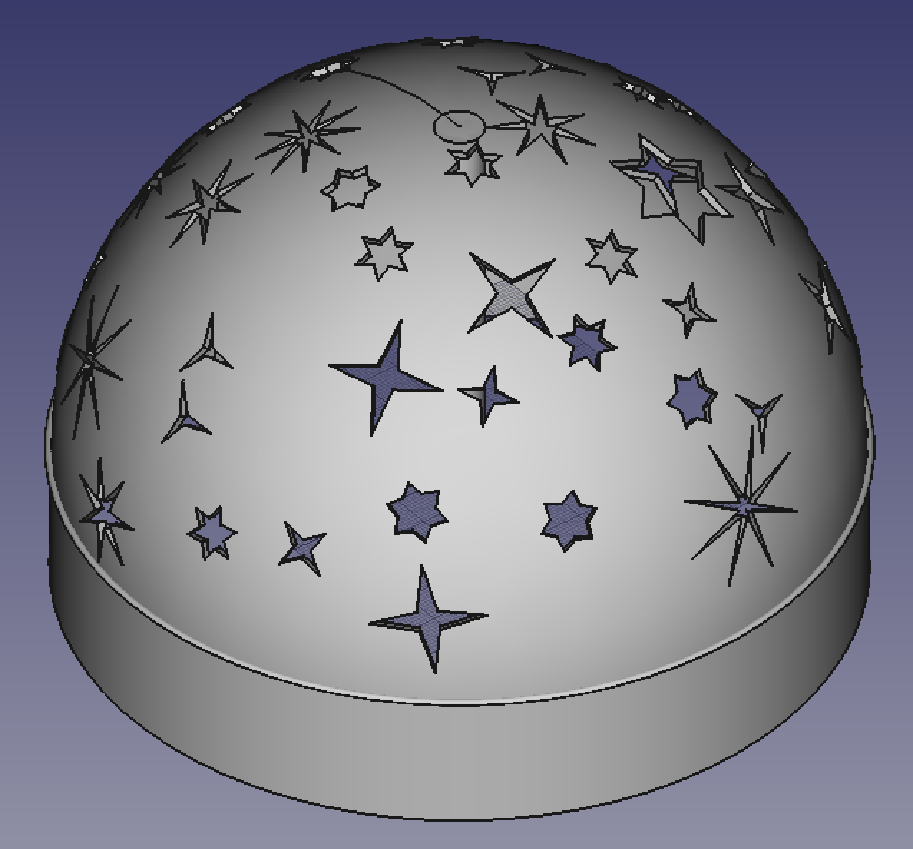

# My macros for different jobs in FreeCAD

## ObjectsSphereDistributor.FCMacro
Create figures in inkscape, and import as geometry in FreeCAD. With 'ObjectsSPhereDistributor' objects will random distribute over sphere inclusive collision detection.

### Workflow
1. Import as SVG-File you objects in FreeCAD
2. Go in Part "Draft-Module"
3. Select all Paths in Combo-View(left)
4. Click on "Upgrade: Joins objects into a higher-level object"
5. Go to "Part-Module" and select "Extrude: Extrudes planar faces of an object"
6. Adjust the high of you object
7. TODO

Sources:  
[Forum FreeCAD in german](https://forum.freecadweb.org/viewtopic.php?f=13&t=25064)  
[Example for collision detection](https://github.com/FreeCAD/FreeCAD-macros/blob/master/Utility/HighlightCommon.FCMacro)  
[How to calculate coordinates from sperical coordinates](https://en.wikipedia.org/wiki/Spherical_coordinate_system)  

Result:

On youtube:
[Start on wall](https://www.youtube.com/watch?v=Owqz37V-LQc)  
[Lamp](https://www.youtube.com/watch?v=VS3f4zUfHAM)  
